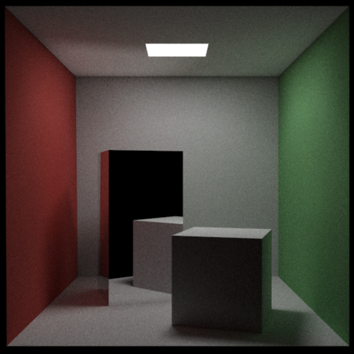

# WebGPU Path Tracing

A simple path tracer powered by WebGPU compute shaders. [Try the demo!](https://iamferm.in/webgpu-path-tracing)

## Path tracer? WebGPU?

Path tracing is a computer graphics rendering technique used to simulate the way light interacts with objects in a virtual scene to create realistic images. It is a method that attempts to model the physical behavior of light as it travels through a scene and interacts with it.

This implementation uses WebGPU compute shaders. WebGPU is an API that exposes the capabilities of modern GPU hardware, allowing accelerated graphics and compute in web applications. 

## What it does NOT have (yet)

* Any materials other than lambertian diffuse and mirror
* Bounding volume hierarchies
* More than one light source
* A denoising stage
* Motion blur
* Textures
* Fog

## How To Use

You can try the demo [here](https://iamferm.in/webgpu-path-tracing).

If you prefer to run it locally, you can just clone the repository and use your favourite web server; it doesn't have any dependencies!
